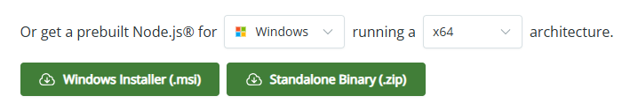
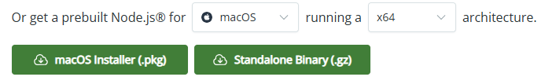

# Implémentation TypeScript

Le programme TypeScript s'exécute facilement en ligne de commande.

Le programme TypeScript est disponible dans StackBlitz pour plus de facilité : https://stackblitz.com/~/github.com/guillaumehx/memoire-implementation-ts . Lancez par exemple dans le terminal : ```ts-node src/main.ts "2+2"```

Sans StackBlitz, il faut télécharger ou cloner le dépôt. Deux options sont possibles :
- Cliquer sur le bouton vert en haut à droite ```<> Code``` puis ```Download ZIP```.
- Ou utiliser git : ``` git clone https://github.com/guillaumehx/memoire-implementation-ts.git ```

Une fois le repository sur votre machine, rendez-vous à la racine et suivez les étapes selon votre système.

Pour TypeScript, il est nécéssaire d'avoir ```node``` ainsi que ```npm```.

## Windows
### 1. Setup
Ouvrez un ``cmd`` à la racine et vérifiez que **node** et **npm** ne sont pas déjà installés en lançant les commandes : ```node -v``` et ```npm -v```
- Si rien ne s'affiche ou que les versions ne sont pas les bonnes, rendez-vous sur le site https://nodejs.org/en/download et téléchargez une version LTS de node, par exemple v22 :\


ℹ️ Node et npm viennent ensemble.

Ensuite, il faut installer **ts-node** globalement avec ```npm install -g ts-node typescript``` et vérifier avec ```ts-node -v```

Enfin toujours à la racine du projet, vous devez installer les dépendances avec ```npm install```

### 2. Exécution

Pour exécuter le programme, lancez ```ts-node src/main.ts "<ARGUMENT>"``` en remplacent ```<ARGUMENT>``` par une expression arithmétique, par exemple ```6+2*(10/5)``` et l'output sera ```10```.
Vous pouvez chaîner les arguments par un espace : ```ts-node src/main.ts "6+2*(10/5)" "2+2" "8-5^2"``` L'output sera alors
~~~~
10
4
-17
~~~~

Pour exécuter les tests, lancez ``npm test``

## Linux
### 1. Setup
Ouvrez un terminal à la racine et vérifiez que **node** et **npm** ne sont pas déjà installés en lançant la commande : ```node -v``` et ```npm -v```

- Si rien ne s'affiche ou que les versions ne sont pas les bonnes, lancez les commandes correspondantes : ```sudo apt install nodejs``` ou ```sudo apt install npm```

Ensuite, il faut installer **ts-node** avec ```sudo npm install -g ts-node typescript``` et vérifier avec ```ts-node -v```

Enfin toujours à la racine du projet, vous devez installer les dépendences avec ```npm install```

### 2. Exécution

Pour exécuter le programme, lancez ```ts-node src/main.ts "<ARGUMENT>"``` en remplacent ```<ARGUMENT>``` par une expression arithmétique, par exemple ```6+2*(10/5)``` et l'output sera ```10```.
Vous pouvez chaîner les arguments par un espace : ```ts-node src/main.ts "6+2*(10/5)" "2+2" "8-5^2"``` L'output sera alors
~~~~
10
4
-17
~~~~

Pour exécuter les tests, lancez ``npm test``

## macOS
### 1. Setup
Ouvrez un terminal à la racine et vérifiez que **node** et **npm** ne sont pas déjà installés en lançant la commande : ```node -v``` et ```npm -v```
- Si l'un des deux est manquant, rendez-vous sur le site https://nodejs.org/en/download choisissez macOS et téléchargez une version LTS, par exemple v22 :\


ℹ️ Node et npm viennent ensemble.

Ensuite, il faut installer **ts-node** globalement avec ```npm install -g ts-node typescript``` et vérifier avec ```ts-node -v```

Enfin toujours à la racine du projet, vous devez installer les dépendences avec ```npm install```

### 2. Exécution

Pour exécuter le programme, lancez ```ts-node src/main.ts "<ARGUMENT>"``` en remplacent ```<ARGUMENT>``` par une expression arithmétique, par exemple ```6+2*(10/5)``` et l'output sera ```10```.
Vous pouvez chaîner les arguments par un espace : ```ts-node src/main.ts "6+2*(10/5)" "2+2" "8-5^2"``` L'output sera alors
~~~~
10
4
-17
~~~~

Pour exécuter les tests, lancez ``npm test``
